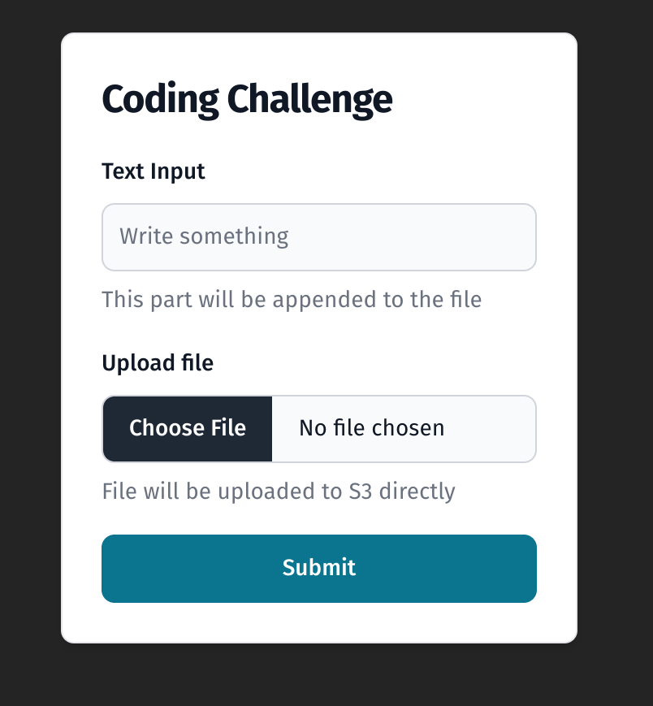
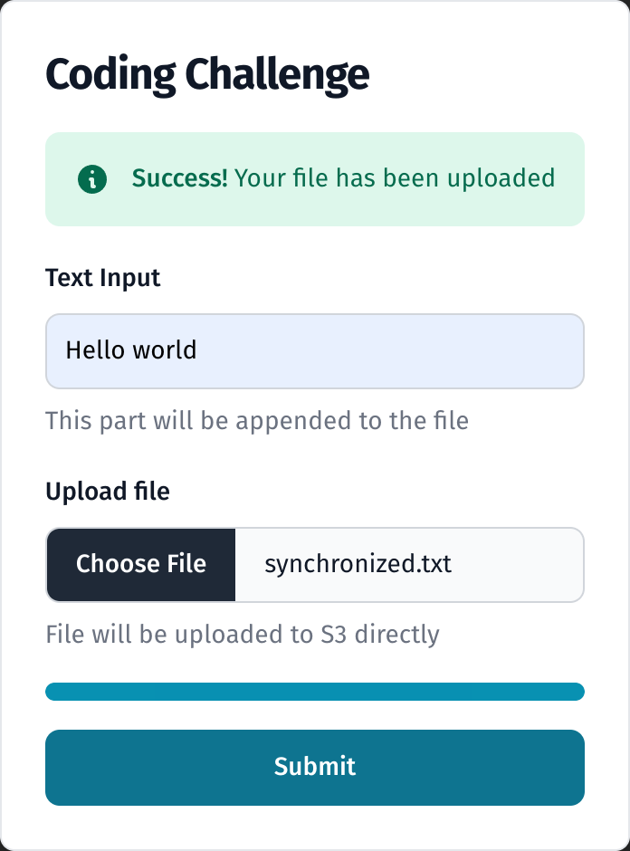
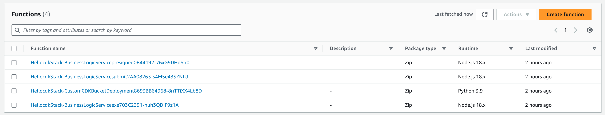
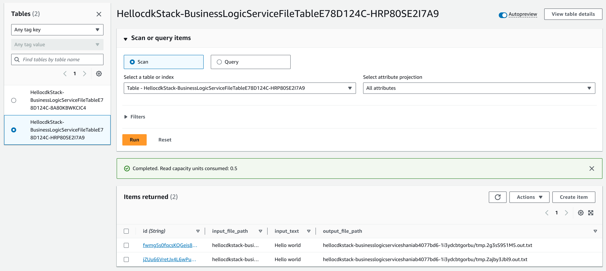

# Welcome to Code Challenge CDK Project Part

## Preview

I have deployed the project to AWS. You can access the website via the following link: http://hellocdkstack-businesslogicservicestaticwebsitebu-17z4kkszqbvz0.s3-website-ap-southeast-1.amazonaws.com/


<details>

<summary>More Preview</summary>




</details>

## Deploy

> Front end part is prebuilt in convenience of deployment. If you want to build it by yourself, please view front end code repository https://github.com/hollykbuck/ccfrontend . Build it and copy `dist` to `public` in this repo. I have a [github action](https://github.com/hollykbuck/ccfrontend/actions/workflows/node.js.yml) build it automatically and you can download the artifact [here](https://github.com/hollykbuck/ccfrontend/suites/16190681253/artifacts/924583710). 

Before deployment, you have to make sure that you have installed the following:
1. aws cli (`aws configure` your IAM account, your account should have enough permission to create resources in AWS)
2. nodejs 18


First Step: 
```
cd hellocdk
npm install --prefix dep
npm install
```

Second Step:

> You **Must** replace `[your account arn]` with your own iam account arn.

```
npm run build

export CDK_DEFAULT_ACCOUNT=[your account arn]
export CDK_DEFAULT_REGION=ap-southeast-1

cdk synth
cdk boostrap
cdk deploy
``````

After `cdk deploy`, the static website will be available in s3. You can access it via `staticWebsiteBucket` s3 Bucket Website Endpoint in `HellocdkStack`.

## Project Structure

This project is a part of the Code Challenge CDK Project. It contains the following:
1. `lib/hellocdk-stack.ts` contains the CDK stack definition
2. `bin/hellocdk.ts` is the entry point of the CDK app
3. `public` folder contains the static web content. 
4. `dep` folder contains the lambda function dependencies layer
5. `script` folder contains the script which will be evaluated in EC2 instance
6. `resources` folder contains the lambda function code

**lambda**
There are three lambda functions, which is presigned, submit and exe. 

`presigned` and `submit` are triggered by API gateway. `exe` is triggered by DynamoDB stream,
it will create a vm and let the vm run a script automatically. `presigned` lambda create a presigned
s3 putobject link for user to upload their file. `submit` lambda saves data to dynamodb. 

## Goals

- [x] Use AWS CDK to manage AWS infrastructure (latest version)
- [x] Use AWS SDK JavaScript V3 for Lambda (latest version, not V2)
- [x] Do not put any AWS access key / credentials in your code, nor environment,  nor config.
- [x] No SSH and no hard-coded parameters.
- [x] Your parameter/variable names are reader-friendly.
- [x] Your txt file in S3 is not public.
- [x] Do not use any AWS Amplify frontend and backend resources.
- [x] Follow the AWS Best Practices.
- [x] After saving the inputs and S3 path in DynamoDB FileTable, your system will create a new VM (not a pre-provisioned VM) and trigger the script to run automatically with error handling.

In addition

- [x] Your frontend code is hosted in S3 or Amplify (not backend)
- [x] Use Flowbite TailwindCSS and ReactJS for Responsive UI
